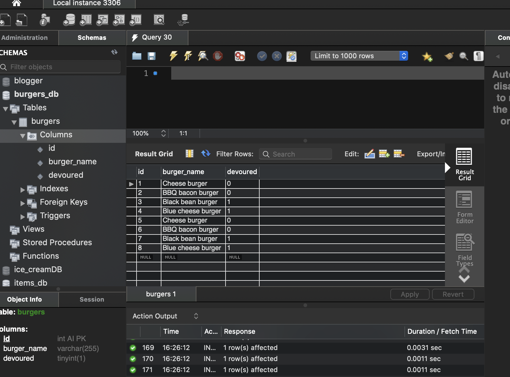
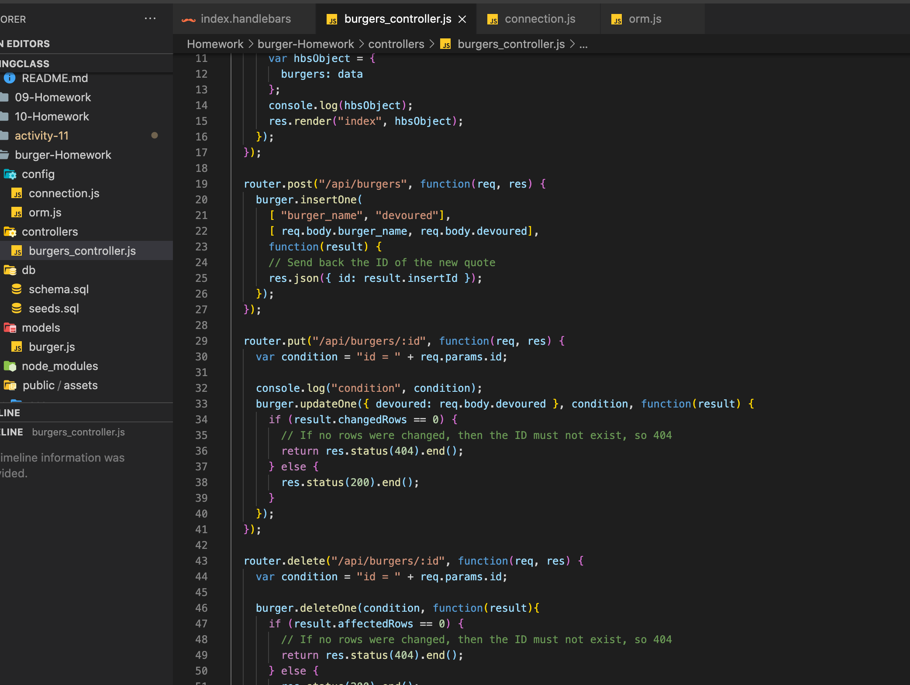

# Homework Thirteen-MVC Team Eat-Da-Burger! 

---

## Description
For this homework assignment we were tasked with creating a web application that allows you to create individual burgers and devour them when you want to. when you create a new burger it should be listed under a ready to devour section. Then when you click devour it should be moved over to the devour section. The first task is to build __new database__ for the burger information. this information should then be pushed into __MySQL__. All of the files need to be place in the correct structure so that they can be called correctly. The web application needs to be correctly deployed to **Heroku**. Success with this project is dependent on whether or not you take the time to set up all of your files correctly, if a file is in the wrong folder or is spelled wrong it will not link correctly and will result in the application not running properly. Make sure that any and all burgers can be made and **Devoured** when the user of the application clicks on the different buttons.

---

## Table of Contents
* [Description](#description)
* [Installation](#installation)
* [ScreenShots](#screenshots)
* [License](#license)
* [Challenges](#challenges)
* [Gif](#gif)
* [Contact](#contact)

---

## Installation

In order to get the __Eat-Da-Burger__ to work, the first task was to download and install all of the necessary programming information. This meant loading all of the necessary __npm__ and __node.js__ add ons. This was extremely easy especially since we went over ane practiced thus several times during class this week. Each of the packages installed in very little time and with the addition of the __config__ folder, all of the necessary password information was included but tucked away safely.

---

## ScreenShots

Here are a few screenshots that I took throughout this homework assignment:

---

## License

MIT

Licensed under the [MIT License](LICENSE).

---

## challenges

This assignment had some big challenges, like many of the other homeworks that we have been tasked with completing. The biggest challenge was making sure that all of the files were set up correctly so that they could be accessed by the web application. I worked with some of our previous assignments to get a good starting point and understand exactly what would be required for each file. Our previous assignments where quite helpful, with the initial set-up and organization. Some problems started to occur for me when I had to adapt the code for this __assignments specifications__. The next challenge that I found with this **eat-da-burger** homework, was setting up the handlebars correctly. In previous examples in this course we had set up the handlebars with minimal html and this assignment wanted us to increase the functionality of our web application. Overall this HW was a fun and interesting assignment to work on, because it was a good representation of what work outside this class will be, instead of projects that only require 1 or two files.

## Gif

Here is the Eat-Da-Burger application  in action:

---

## Contact

If you would like to contact me:

GitHub: [Arewinkl](https://github.com/arewinkl)

Email: alecrewinkel@gmail.com

